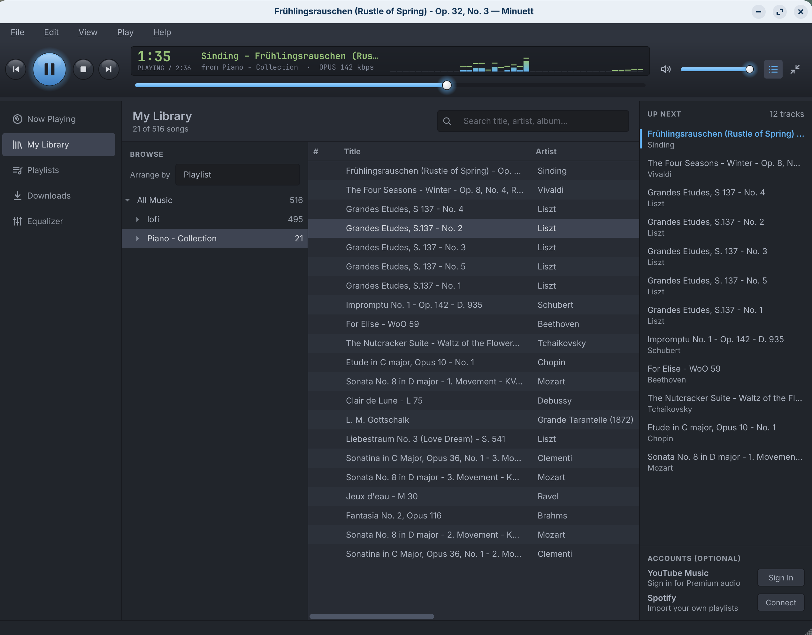
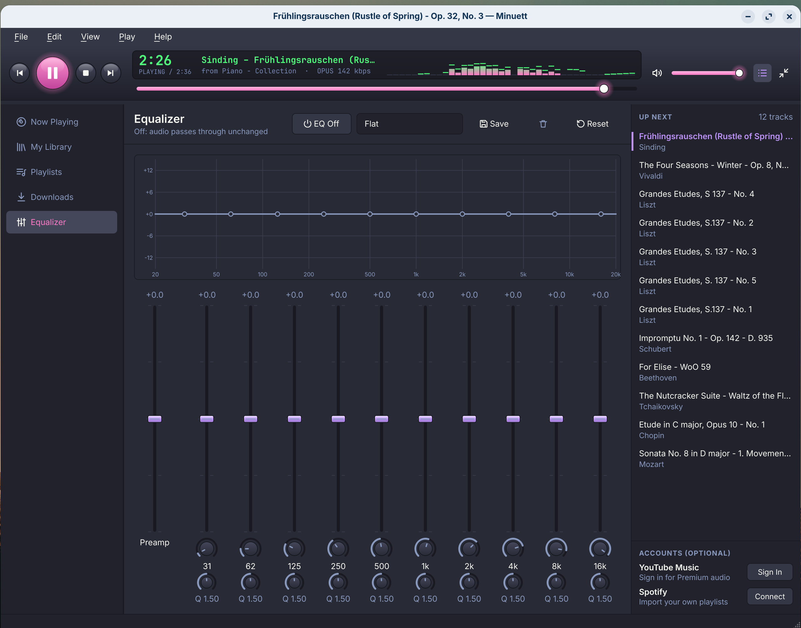
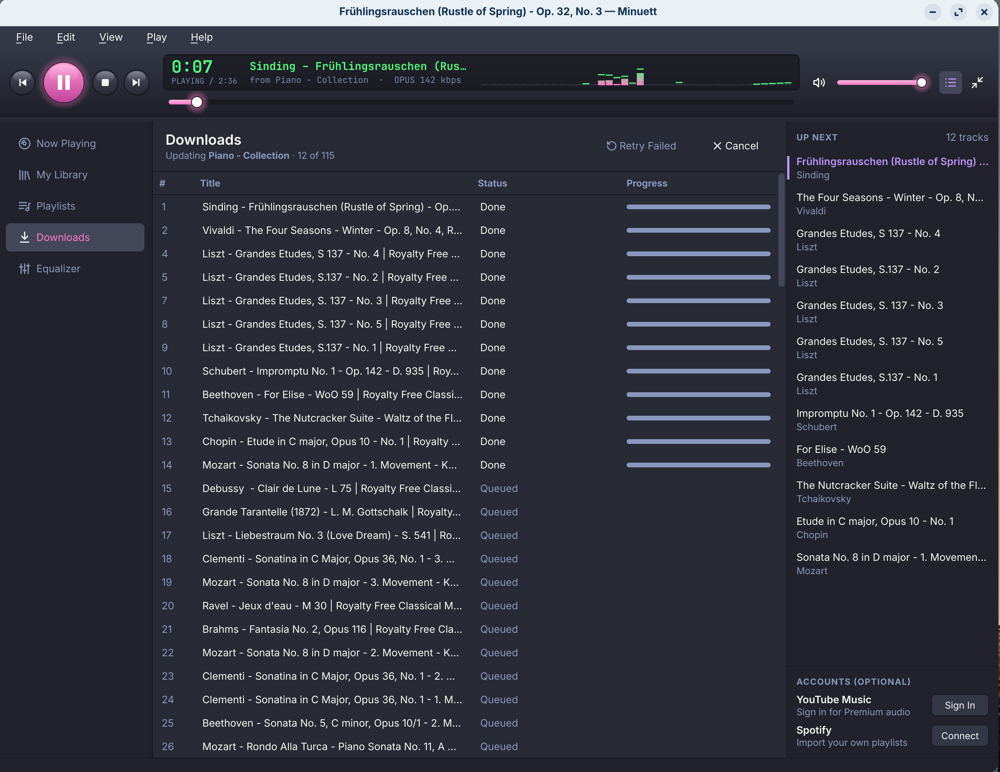
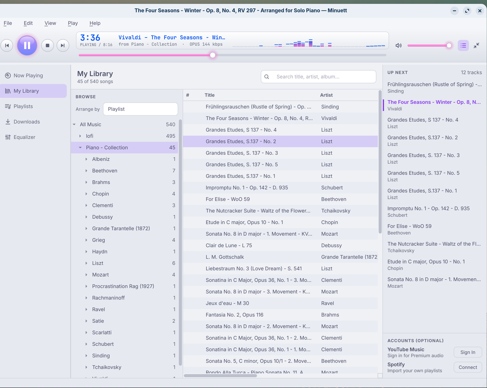
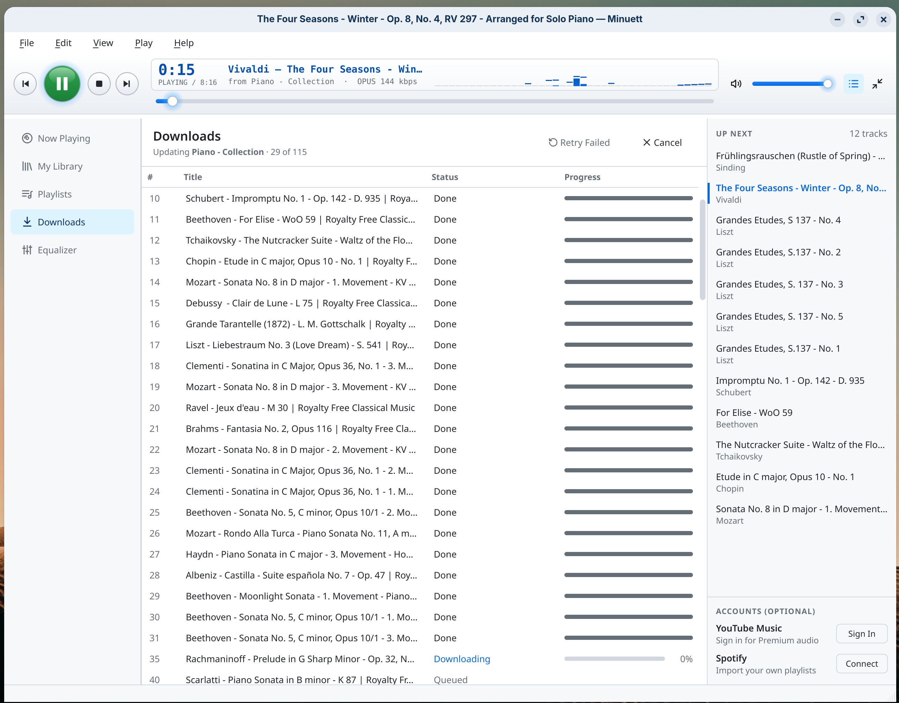

# Minuett

If Winamp was my first real introduction to the idea of a playlist, then Realplayer 10 (in 2005) was my introduction to the jukebox-style "library" of music sorted by name and artis and nicely catalogued, instead of being in a mess of folders on my drive.



Minuett is a return to those times, in spirit. It is a library-first music player for Linux that is inspired by Realplayer 10 and Winamp. It has top bar with a spectrum analyzer, a 10-band parametric equalizer.

And because this is not 2004, it allows you to import playlists pulled in from YouTube, YouTube Music, Spotify and Pandora. When you import a playlist, Minuett will download the tracks, covert them to .opus (which is a free and open file format) and populate your library automatically. You can also import folders as playlists. 

Minuett is built for my own needs. I wanted a handy way of playing music as I write in a way that didn't always depend on an Internet connection. I only described the design and the functions; the actual work was done by Claude 5.5 Sonnet. 

We got a little bit carried away adding a few features from friends ( Spotify, for instance, neither of which I use), but I've kept it as clean and simple as possible. 


## A note on downloading

The DMCA prohibits downloading content you don't have the rights to. I personally use it for royalty free or creative commons playlists of classical music. Use it for content you have the right to keep. 


## Features

**Playback & Audio Engine**

* **Gapless Playback:** Full support for Opus, FLAC, AAC/M4A, MP3, Ogg Vorbis, and WAV via GStreamer.
* **Pro-Grade Equalizer:** 10-band parametric EQ featuring pre-amps, custom presets, and a mathematically precise live response curve.
* **Nostalgic Visuals:** Features a Winamp-style post-EQ spectrum analyzer and glowing transport sliders.
* **Toolbar Mode:** Instantly shrink the player to a minimal transport strip with a hotkey (`Ctrl+T`).



**Smart Library Management**

* **Fast & Lightweight:** Powered by SQLite with incremental folder scanning (skips unchanged files for rapid rescans).
* **Advanced Tag Editing:** Built-in batch editor and cover-art manager. Files are written safely before the library updates to prevent corruption.
* **Auto-Tidying:** Automatically extracts genre tags from cluttered titles (e.g., moves "[lofi hip hop]" to the genre field).
* **Deep Browsing:** Live search across all metadata, or browse by standard tags, Date Added, or Source.

**Cloud Import & Sync**

* **Bring Your Playlists:** Paste a link from YouTube, YT Music, or Spotify to import the whole list. 
* **Smart Downloading:** Downloads tracks natively in Opus (bit-perfect from YouTube) or MP3 V0. Supports YouTube Premium sign-in for high-bitrate streams.
* **Non-Destructive Updates:** Check playlists individually for updates. It only downloads new additions, never overwrites your local edits, and won't delete songs you want to keep if they vanish upstream.
* **Live Folders:** Import a local folder as a playlist; added or removed files sync automatically on rescan.



**Theming & Customization**

* **11 Built-In Themes:** Includes RealPlayer Classic (default), Dracula, Nord, Monokai Pro, Catppuccin Latte, and more. All default themes meet WCAG AA text contrast standards.
* **Live CSS Reloading:** Tweak colors, typography, and spacing by editing a simple CSS file of variables—changes apply instantly as you save.

<p>
  
  
</p>

**Privacy and local-first**
- No telemetry, no accounts of its own, no analytics.
- Minuett only goes online when you ask it to: to read a playlist you pasted,
  to search YouTube Music for Spotify/Pandora songs, to download, to sign in,
  or to check PyPI for a yt-dlp update (Help menu).
- Browser sign-ins are read locally and sent only to YouTube, the same way
  your browser sends them. Spotify tokens go only to Spotify.
  
## Using it

- **Add music:** File ▸ Import Folder as Playlist… (Ctrl+Shift+I), File ▸
  Add Music Folder…, or Playlists ▸ Import Playlist (Ctrl+I).
- **Play/pause:** double-click a song or press Enter.
- **Edit, move or remove songs:** right-click a song in the table or the
  browse tree.
- **Download a playlist:** Playlists ▸ Import, paste the link, review the
  list, then Download. Later, select the playlist and press Check or Update.

### Keyboard shortcuts

| Keys | Action |
|---|---|
| Space | Play / pause |
| Enter, double-click | Play the selected song, or pause/resume it |
| Ctrl+. | Stop |
| Ctrl+← / Ctrl+→ | Previous / next |
| F2 | Edit the selected cell |
| Ctrl+E | Edit tags of the selected songs |
| Delete | Delete the selected songs |
| Ctrl+I | Import a playlist |
| Ctrl+Shift+I | Import a folder as a playlist |
| F5 | Rescan the library |
| Ctrl+T | Toolbar mode (Esc returns) |
| Ctrl+, | Preferences |
| Ctrl+Q | Quit |

### Optional sign-ins

Under **Accounts** at the bottom of the right sidebar. Everything works
without them.

- **YouTube Music:** reuses the sign-in of a browser you already use (Firefox,
  Chrome, Chromium, Brave, Edge, Vivaldi, Opera) or an exported
  `cookies.txt`. Minuett never sees your password. In the Flatpak, the dialog
  shows a one-line command that grants read-only access to just that
  browser's cookie folder. YouTube can restrict accounts it sees used by
  download tools; Minuett paces its requests, but the risk isn't zero.
- **Spotify:** Spotify only lets registered apps sign in, and since February
  2026 only lists the songs of playlists you own or collaborate on. Create a
  free app on the [Spotify Developer Dashboard](https://developer.spotify.com/dashboard)
  (its owner needs Premium), add the redirect URI shown in the dialog, and
  paste the Client ID. Sign-in uses PKCE; no client secret is stored.

Sign-in details are kept in `accounts.json` (see below), readable only by
you. Sign out from the same dialog to delete them.


## Installing

Download the Flatpak bundle or the AppImage from the
[Releases](../../releases) page. Now presumably you know how to use Flatpak or AppImage - I personally use bauh and Gear Lever - but, just in case:

### Flatpak

Needs the Flathub remote (for the GNOME 50 runtime):

```bash
flatpak remote-add --user --if-not-exists flathub https://dl.flathub.org/repo/flathub.flatpakrepo
```

```bash
flatpak install --user Minuett-0.2.0-x86_64.flatpak
```

```bash
flatpak run io.github.yudhanjaya.Minuett
```

The Flatpak can read and write `~/Music` (downloads go to
`~/Music/Minuett/<playlist>/`). To use music stored elsewhere:

```bash
flatpak override --user --filesystem=/path/to/music io.github.yudhanjaya.Minuett
```

### AppImage

Bundles Python, GStreamer, ffmpeg and Deno. Needs glibc 2.39 or newer
(Ubuntu 24.04, Fedora 40, Debian 13, or later).

```bash
chmod +x Minuett-0.2.0-x86_64.AppImage
```

```bash
./Minuett-0.2.0-x86_64.AppImage
```


## Updating and uninstalling

Install the new Flatpak bundle or AppImage over the old one; your library, settings and downloads are kept.

YouTube changes often, and an old yt-dlp is the most common reason downloads
start failing. Help ▸ Check for yt-dlp Update tells you if a newer one exists;
in the Flatpak and AppImage it's bundled, so get the latest Minuett release.

To uninstall:

```bash
flatpak uninstall --user io.github.yudhanjaya.Minuett
```

For the AppImage, delete the file. To remove settings and the library too,
delete the folders in the table above (for the Flatpak,
`~/.var/app/io.github.yudhanjaya.Minuett`). Your music in `~/Music` is never
removed.

## Your data

| What | Native / AppImage | Flatpak |
|---|---|---|
| Downloads | `~/Music/Minuett/<playlist>/` (changeable in Preferences) | same |
| Library database | `~/.local/share/minuett/library.db` | `~/.var/app/io.github.yudhanjaya.Minuett/data/minuett/` |
| Settings, EQ, sign-ins, custom themes | `~/.config/minuett/` | `~/.var/app/io.github.yudhanjaya.Minuett/config/minuett/` |

The library database only records where your files are, plus the playlists
you imported. Deleting it never touches your music; Minuett rebuilds it on
the next scan (imported playlists would need importing again).

## Known limitations

- Linux on x86_64 only.
- Spotify links without sign-in show at most 100 songs (the public page's
  limit). Signed in, you can import your own and collaborative playlists in
  full, but not other people's (Spotify's rule since February 2026).
- Pandora has no playlist links; export a file instead.
- Songs from Spotify, Pandora and files are YouTube Music matches, not the
  original recordings. Occasionally the match is a different version.
- Editing a playlist in Minuett doesn't change it on YouTube or Spotify.
- No media-key or desktop "now playing" (MPRIS) support yet.
- Region-locked, private, age-restricted and members-only videos can't be
  downloaded without a suitable sign-in, and some not at all. Live streams
  are skipped.

## Troubleshooting

- **Some songs say "unavailable" or failed:** the video was removed, made
  private, or is blocked in your region. Retry Failed tries again later;
  unavailable songs aren't retried.
- **Many downloads fail at once (HTTP 403, "sign in to confirm"):** YouTube
  is rate-limiting. Wait a while, sign in to YouTube Music, and make sure
  yt-dlp is current.
- **The browser sign-in isn't found in the Flatpak:** run the one-line
  `flatpak override` command the sign-in dialog shows, then restart Minuett.
- **Music outside `~/Music` doesn't appear in the Flatpak:** grant the folder
  (see Installing).
- **The AppImage doesn't start:** run it with `--appimage-extract-and-run`
  if FUSE isn't available.


## Building from source

System packages (Debian/Ubuntu names):

```bash
sudo apt install python3-gi gir1.2-gstreamer-1.0 gstreamer1.0-plugins-good gstreamer1.0-plugins-bad gstreamer1.0-libav ffmpeg libxcb-cursor0
```

```bash
python3.12 -m venv --system-site-packages .venv
```

```bash
.venv/bin/pip install -e '.[dev]'
```

```bash
.venv/bin/python -m minuett
```

Tests (headless; tones are generated with ffmpeg, audio goes to a fakesink):

```bash
.venv/bin/python -m pytest
```

Packages:

```bash
./packaging/flatpak/build.sh
```

```bash
./packaging/appimage/build.sh
```

The Flatpak build needs `org.flatpak.Builder` and `org.gnome.Sdk//50` from
Flathub. Python wheels are pinned in `packaging/flatpak/python-deps.json`;
regenerate with `python3 tools/gen_flatpak_deps.py` after changing
dependencies. Build the AppImage on the oldest distro you want to support.

## Project layout

```
minuett/
  core/          # Qt-free: player, library, downloader, equalizer, visualizer, accounts
  ui/            # PySide6 window, views, dialogs
    skin/        # base.qss, painted widgets, icons, themes/*.css
  selftest.py    # minuett --self-test
packaging/       # desktop file, metainfo, icon, flatpak/, appimage/
tools/           # packaging helpers
tests/
docs/            # PLAN.md (design notes), THEMES.md
```

## Credits

Minuett stands on these projects:

| Project | Used for | License |
|---|---|---|
| [Python](https://www.python.org) | language | PSF |
| [Qt 6](https://www.qt.io) / [PySide6](https://doc.qt.io/qtforpython-6/) | interface | LGPL-3.0 |
| [GStreamer](https://gstreamer.freedesktop.org) | playback, equalizer (`equalizer-nbands`), analyzer (`spectrum`) | LGPL-2.1+ |
| [PyGObject](https://pygobject.gnome.org) | GStreamer bindings | LGPL-2.1+ |
| [yt-dlp](https://github.com/yt-dlp/yt-dlp) and [yt-dlp-ejs](https://github.com/yt-dlp/ejs) | YouTube and YouTube Music | Unlicense |
| [FFmpeg](https://ffmpeg.org) | audio extraction and conversion | LGPL-2.1+ / GPL |
| [Deno](https://deno.com) | JavaScript runtime yt-dlp needs for YouTube | MIT |
| [mutagen](https://github.com/quodlibet/mutagen) | reading and writing tags and cover art | GPL-2.0-or-later |
| [SQLite](https://sqlite.org) | library database | public domain |
| [SecretStorage](https://github.com/mitya57/secretstorage), [cryptography](https://cryptography.io) | reading browser sign-ins for YouTube Music | BSD-3-Clause / Apache-2.0 or BSD |
| [Flatpak](https://flatpak.org) with the GNOME runtime, [AppImage](https://appimage.org) | packaging | LGPL-2.1+ / MIT |

Theme palettes are Minuett's own interpretations of
[One Dark Pro](https://github.com/Binaryify/OneDark-Pro),
[Dracula](https://draculatheme.com), [Monokai Pro](https://monokai.pro),
[Night Owl](https://github.com/sdras/night-owl-vscode-theme),
[SynthWave '84](https://github.com/robb0wen/synthwave-vscode),
[Cobalt2](https://github.com/wesbos/cobalt2-vscode), [Nord](https://www.nordtheme.com),
[Gruvbox](https://github.com/morhetz/gruvbox),
[GitHub Theme](https://github.com/primer/github-vscode-theme) and
[Catppuccin](https://catppuccin.com), chosen from the most-installed list on
[vscodethemes.com](https://vscodethemes.com). The look is modelled on
RealPlayer 10 and Winamp. Minuett isn't affiliated with any of these, or with
YouTube, Spotify or Pandora.

## How it was made

Minuett was built with **Claude Opus 5.5** (Anthropic) in Claude Code, in a
single long session that ran from the design plan to packaging.

Token estimate for the session so far: the working context reached about
**870,000 tokens**. Counting every model call (each re-reads the
conversation, mostly from cache), the total processed is roughly
**100–150 million input tokens** and about **0.5 million output tokens**.


## License


Minuett is free software: you can redistribute it and/or modify it under the
terms of the GNU General Public License 3  as published by the Free Software
Foundation. [Read the license here](https://opensource.org/license/gpl-3.0).

In a nutshell: 

* **Copyleft and Viral Sharing:** You are free to use, modify, and distribute the software, but any modified versions or derivative works you share must also be released under the exact same GPL v3 license.
* **Source Code Transparency:** If you distribute the software to others (whether modified or not), you must provide them with the complete, human-readable source code, not just the compiled executable.
* **Absolute Lack of Liability (No Warranty):** The software is provided entirely "as is," meaning the original creators hold zero warranty, liability, or responsibility for any damages, bugs, or consequences resulting from whatever you choose to do with the software.
